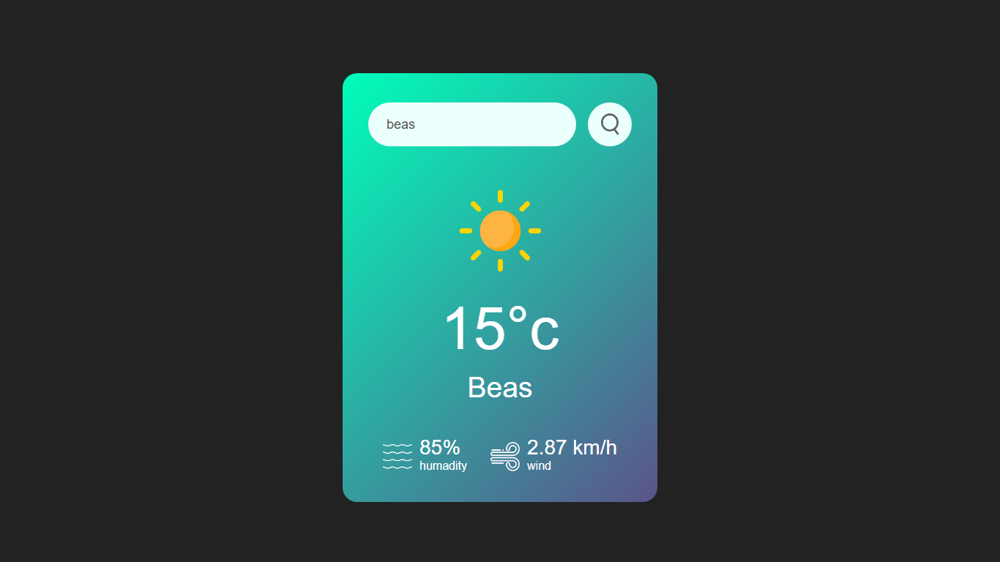

# Weather App 🌦️

A simple weather application built using HTML, CSS, and JavaScript that allows users to fetch real-time weather data for any city.

## ✨ Features

- 🌟 Fetch and display weather information (temperature, humidity, wind speed) for any city.
- 🌟 Show weather icons representing the current conditions.
- 🌟 Error handling for invalid city names or when weather data is not available.

## 🛠️ Technologies Used

- 🧑‍💻 **HTML5** - The standard structure for web pages.
- 🎨 **CSS3** - Styling for the application to make it responsive and visually appealing.
- ⚙️ **JavaScript (ES6+)** - Logic to fetch and display weather data.
- ☁️ **[OpenWeatherMap API](https://openweathermap.org/)** - API to get real-time weather data.

## 🚀 Installation

1. Clone the repository:
   ```bash
   git clone https://github.com/Bharat-Dua/weather-app-JS.git
   ```
2. Open the project in your code editor.
3. **Open** `index.html` in your browser.

   _No additional installation or build steps are required since this project is built with pure HTML, CSS, and JavaScript._

## ⚙️ Usage

- ✏️ **Enter** a city name in the search input field.
- 🔍 **Click** the "Search" button.
- 📊 **View** the weather details for the city (temperature, humidity, and wind speed).
- ❌ **If invalid**, an error message will appear below the search bar.

## 📸 Screenshots



## ⚠️ Error Handling

- If the user enters an invalid city or there is a problem fetching data from the API, an error message will be shown on the interface.
- Example: _"City not found. Please enter a valid city name."_

## 🌐 API Reference

- **OpenWeatherMap API**: Used to fetch weather data for a specific city by making HTTP requests.
